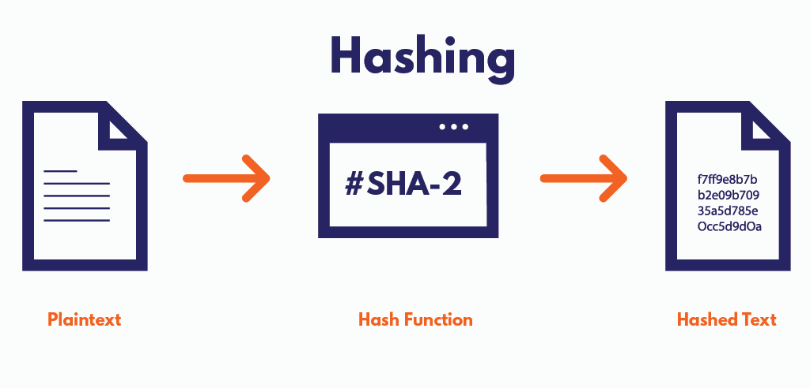

# Hashing
- __Hashing__ is the process of generating a value from a text or a list of numbers using a mathematical function known as a _hash function_.  
- A __Hash Function__ is a funtion that converts a given numeric or alphanumeric key to a small practical integer value. The mapped integer value is used as an index in the __hash table__.  
- For example, given an array $\text{A}$, if $\text{i}$ is the key, then we can find the value by simply looking up $\text{A[i]}$.  

## Types of Hash functions
There are many hash functions that use numeric or alphanumeric keys. THis article focuses on discussing different hash functions:  
1. __Division Method__
2. __Mid Square Method__
3. __Folding Method__
4. __Multiplicatoin Method__
### 1. Division Method
This is the most simple and easiest method to generate a hash value. The hash function divides the value k by M and then uses the remainder obtained.  
__Formula :__
> $\text{h(K) = K mod M}$  
> Here,  
> $\text{K}$ is the __key value__  
> $\text{M}$ is the __size of the hash table__
     
It is best suited that M is a prime number as that can make sure the keys are more uniformly distributed. The hash function is dependent upon the remainder of a divison.    
__Example:__  
> $\text{K} = 2002$  
> $\text{M} = 101$  
> $\text{h}(2002) = 2002 \text{ mod } 101 = 83$  
> $\text{K} = 1276$    
> $\text{M} = 11$  
> $\text{h}(1276) = 1276 \text{ mod } 11 = 0$  

__Pros:__  
- This method is quite good for any value of $\text{M}$.    
- The division method is very fast since it requires only a single division operation.  

__Cons:__
- This method leads to poor performance since consecutive keys map to consecutive hash values in the hash table.  
- Sometimes extra care should be taken to choose the value of $\text{M}$.  
### 2. Mid Square Method  
The mid-square method is a very good hashing method. It involves two steps to compute the hash value: 
1. Square the value of the key i.e $K^2$
2. Extract the middle r digits as the hash value.  
__Formula:__
> $\text{h(K) = h(K x K)}$  
> Here, 
> $\text{K}$ is the key value  
  
The value of $\text{r}$ can be decided based on the size of the table.  
__Example:__  
Suppose the hash table has $100$ memory location so $\text{r} = 2$ because two digits are required to map the key to the memory location.

## Reference
[1] [Hash Functions and list/types of Hash functions](https://www.geeksforgeeks.org/hash-functions-and-list-types-of-hash-functions/)  
[2] [What is Hashing?](https://www.geeksforgeeks.org/what-is-hashing/)  
[3] [What are hash functions, and how do hashes work in crypto?](https://blog.pantherprotocol.io/what-are-hash-functions-and-how-do-hashes-work-in-crypto/)
